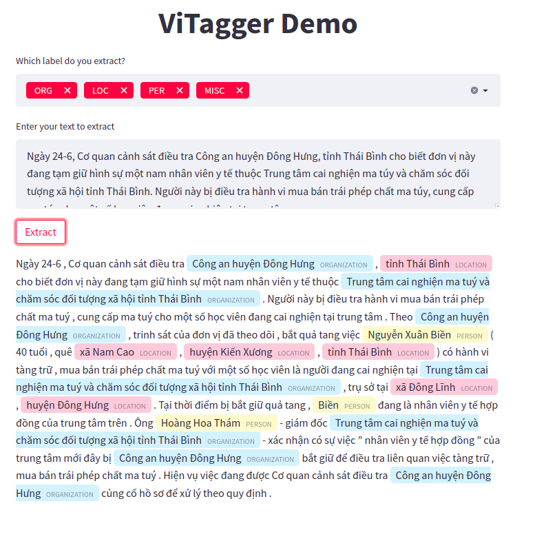

# <div align="center">🍜VPhoBertTagger</div>

Token classification using Phobert Models for 🇻🇳Vietnamese

## <div align="center">🏞️Environments🏞️</div>
Get started in seconds with verified environments. Run script below for install all dependencies
```bash
bash ./install_dependencies.sh
```
## <div align="center">📚Dataset📚</div>
The input data's format of 🍜**VPhoBertTagger** follows [**VLSP-2016**](https://vlsp.org.vn/vlsp2016/eval/ner) format with four columns separated by a tab character, 
including of **word**, **pos**, **chunk**, and **named entity**. Each word which was segmented has been put on a separate line and there is 
an empty line after each sentence. For details, see sample data in **'datasets/samples'** directory. The table below describes an 
example Vietnamese sentence in dataset.


| Word         | POS | Chunk | NER   |
|--------------|-----|-------|-------|
| Dương	       |Np	  |B-NP	  |B-PER  |
| là	          |V	  |B-VP	  |O      |
| một	         |M	  |B-NP	  |O      |
| chủ       	  |N	  |B-NP	  |O      |
| cửa hàng   	 |N	  |B-NP	  |O      |
| lâu	         |A	  |B-AP	  |O      |
| năm	         |N	  |B-NP	  |O      |
| ở	           |E	  |B-PP	  |O      |
| Hà Nội 	     |Np	  |B-NP	  |B-LOC  |
| .	           |CH	  |O	  |O      |

The dataset must put on directory with structure as below.
```text
├── data_dir
|  └── train.txt
|  └── dev.txt
|  └── test.txt
```

## <div align="center">🎓Training🎓</div>
The commands below fine-tune **PhoBert** for Token-classification task. [Models](https://github.com/VinAIResearch/PhoBERT) download automatically from the latest
Hugging Face [release](https://huggingface.co/vinai)
```bash
python main.py train --task vlsp2016 --run_test --data_dir ./datasets/vlsp2016 --model_name_or_path vinai/phobert-base --model_arch softmax --output_dir outputs --max_seq_length 256 --train_batch_size 32 --eval_batch_size 32 --learning_rate 3e-5 --epochs 20 --early_stop 2 --overwrite_data
```

or

```bash
bash ./train.sh
```

> Arguments:
> + ***type*** (`str`,`*required`): What is process type to be run. Must in [`train`, `test`, `predict`, `demo`].
> + ***task*** (`str`, `*optional`): Training task selected in the list: [`vlsp2016`, `vlsp2018_l1`, `vlsp2018_l2`, `vlsp2018_join`]. Default: `vlsp2016`
> + ***data_dir*** (`Union[str, os.PathLike]`, `*required`): The input data dir. Should contain the .csv files (or other data files) for the task.
> + ***overwrite_data*** (`bool`, `*optional`) : Whether not to overwirte splitted dataset. Default=False
> + ***load_weights*** (`Union[str, os.PathLike]`, `*optional`): Path of pretrained file.
> + ***model_name_or_path*** (`str`, `*required`): Pre-trained model selected in the list: [`vinai/phobert-base`, `vinai/phobert-large`,...] Default=`vinai/phobert-base` 
> + ***model_arch*** (`str`, `*required`): Punctuation prediction model architecture selected in the list: [`softmax`, `crf`, `lstm_crf`].
> + ***output_dir*** (`Union[str, os.PathLike]`, `*required`): The output directory where the model predictions and checkpoints will be written.
> + ***max_seq_length*** (`int`, `*optional`): The maximum total input sequence length after WordPiece tokenization. Sequences longer than this will be truncated, and sequences shorter than this will be padded. Default=190.
> + ***train_batch_size*** (`int`, `*optional`): Total batch size for training. Default=32.
> + ***eval_batch_size*** (`int`, `*optional`): Total batch size for eval. Default=32.
> + ***learning_rate*** (`float`, `*optional`): The initial learning rate for Adam. Default=1e-4.
> + ***classifier_learning_rate*** (`float`, `*optional`): The initial classifier learning rate for Adam. Default=5e-4.
> + ***epochs*** (`float`, `*optional`): Total number of training epochs to perform. Default=100.0.
> + ***weight_decay*** (`float`, `*optional`): Weight deay if we apply some. Default=0.01.
> + ***adam_epsilon*** (`float`, `*optional`): Epsilon for Adam optimizer. Default=5e-8.
> + ***max_grad_norm*** (`float`, `*optional`): Max gradient norm. Default=1.0.
> + ***early_stop*** (`float`, `*optional`): Number of early stop step. Default=10.0.
> + ***no_cuda*** (`bool`, `*optional`): Whether not to use CUDA when available. Default=False.
> + ***run_test*** (`bool`, `*optional`): Whether not to run evaluate best model on test set after train. Default=False.
> + ***seed*** (`bool`, `*optional`): Random seed for initialization. Default=42.
> + ***num_workers*** (`int`, `*optional`): how many subprocesses to use for data loading. 0 means that the data will be loaded in the main process. Default=0.
> + ***save_step*** (`int`, `*optional`): The number of steps in the model will be saved. Default=10000.
> + ***gradient_accumulation_steps*** (`int`, `*optional`): Number of updates steps to accumulate before performing a backward/update pass. Default=1.

## <div align="center">📈Tensorboard📈</div>
The command below start Tensorboard help you follow fine-tune process.
```bash
tensorboard --logdir runs --host 0.0.0.0 --port=6006
```

## <div align="center">🥇Performances🥇</div>
All experiments were performed on an **RTX 3090** with **24GB VRAM**, and  a CPU **Xeon® E5-2678 v3** with **64GB RAM**, both of which are available for rent on **[vast.ai](https://vast.ai/)**. The pretrained-model used for comparison are available on **[HuggingFace](https://huggingface.co/models)**.
### VLSP 2016
<details>
    <summary>Click to expand!</summary>
    <table align="center">
        <thead>
            <tr>
                <th align="center" rowspan="2" colspan="2">Model</th>
                <th align="center" colspan="4">BIO-Metrics</th>
                <th align="center" colspan="5">NE-Metrics</th>
                <th align="center" rowspan="2">Log</th>
            </tr>
            <tr>
                <th align="center">Accuracy</th>
                <th align="center">Precision</th>
                <th align="center">Recall</th>
                <th align="center">F1-score</th>
                <th align="center">Accuracy<br>(w/o 'O')</th>
                <th align="center">Accuracy</th>
                <th align="center">Precision</th>
                <th align="center">Recall</th>
                <th align="center">F1-score</th>
            </tr>
        </thead>
        <tbody>
            <tr>
                <td align="left" rowspan="3">Bert-base-multilingual-cased [1]</td>
                <td align="left">Softmax</td>
                <td align="center">0.9905</td>
                <td align="center">0.9239</td>
                <td align="center">0.8776</td>
                <td align="center">0.8984</td>
                <td align="center">0.9068</td>
                <td align="center">0.9905</td>
                <td align="center">0.8938</td>
                <td align="center">0.8941</td>
                <td align="center">0.8939</td>
                <td align="left">
                    <a href="./statics/confusion_matrix/bert_ml_vlsp2016.png">Maxtrix</a>
                    <br/>
                    <a href="./statics/train_logs/bert_ml_vlsp2016.log">Log</a>
                </td>
            </tr>
            <tr>
                <td align="left">CRF</td>
                <td align="center">0.9903</td>
                <td align="center">0.9241</td>
                <td align="center">0.8880</td>
                <td align="center">0.9048</td>
                <td align="center">0.9087</td>
                <td align="center">0.9903</td>
                <td align="center">0.8951</td>
                <td align="center">0.8945</td>
                <td align="center">0.8948</td>
                <td align="left">
                    <a href="./statics/confusion_matrix/bert_ml_crf_vlsp2016.png">Maxtrix</a>
                    <br/>
                    <a href="./statics/train_logs/bert_ml_crf_vlsp2016.log">Log</a>
                </td>
            </tr>
            <tr>
                <td align="left">LSTM_CRF</td>
                <td align="center">0.9905</td>
                <td align="center">0.9183</td>
                <td align="center">0.8898</td>
                <td align="center">0.9027</td>
                <td align="center">0.9178</td>
                <td align="center">0.9905</td>
                <td align="center">0.8879</td>
                <td align="center">0.8992</td>
                <td align="center">0.8935</td>
                <td align="left">
                    <a href="./statics/confusion_matrix/bert_ml_lstm_crf_vlsp2016.png">Maxtrix</a>
                    <br/>
                    <a href="./statics/train_logs/bert_ml_lstm_crf_vlsp2016.log">Log</a>
                </td>
            </tr>
            <tr>
                <td align="left" rowspan="3">PhoBert-base [2]</td>
                <td align="left">Softmax</td>
                <td align="center">0.9950</td> 
                <td align="center">0.9312</td>
                <td align="center">0.9404</td>
                <td align="center">0.9348</td>
                <td align="center">0.9570</td>
                <td align="center">0.9950</td>
                <td align="center">0.9434</td>
                <td align="center">0.9466</td>
                <td align="center">0.9450</td>
                <td align="left">
                    <a href="./statics/confusion_matrix/phobert_softmax_vlsp2016.png">Maxtrix</a>
                    <br/>
                    <a href="./statics/train_logs/phobert_softmax_vlsp2016.log">Log</a>
                </td>
            </tr>
            <tr>
                <td align="left">CRF</td>
                <td align="center">0.9949 </td>
                <td align="center">0.9497</td>
                <td align="center">0.9248</td>
                <td align="center">0.9359</td>
                <td align="center">0.9525</td>
                <td align="center">0.9949</td>
                <td align="center">0.9516</td>
                <td align="center">0.9456</td>
                <td align="center">0.9486</td>
                <td align="left">
                    <a href="./statics/confusion_matrix/phobert_crf_vlsp2016.png">Maxtrix</a>
                    <br/>
                    <a href="./statics/train_logs/phobert_crf_vlsp2016.log">Log</a>
                </td>        
            </tr>
            <tr>
                <td align="left">LSTM_CRF</td>
                <td align="center">0.9949</td>
                <td align="center">0.9535</td>
                <td align="center">0.9181</td>
                <td align="center">0.9349</td>
                <td align="center">0.9456</td>
                <td align="center">0.9949</td>
                <td align="center">0.9520</td>
                <td align="center">0.9396</td>
                <td align="center">0.9457</td>
                <td align="left">
                    <a href="./statics/confusion_matrix/phobert_lstm_crf_vlsp2016.png">Maxtrix</a>
                    <br/>
                    <a href="./statics/train_logs/phobert_lstm_crf_vlsp2016.log">Log</a>
                </td> 
            </tr>
            <tr>
                <td align="left" rowspan="3">viBERT [3]</td>
                <td align="left">Softmax</td>
                <td align="center">...</td>
                <td align="center">...</td>
                <td align="center">...</td>
                <td align="center">...</td>
                <td align="center">...</td>
                <td align="center">...</td>
                <td align="center">...</td>
                <td align="center">...</td>
                <td align="center">...</td>
                <td align="center">...</td>
            </tr>
            <tr>
                <td align="left">CRF</td>
                <td align="center">...</td>
                <td align="center">...</td>
                <td align="center">...</td>
                <td align="center">...</td>
                <td align="center">...</td>
                <td align="center">...</td>
                <td align="center">...</td>
                <td align="center">...</td>
                <td align="center">...</td>
                <td align="center">...</td>
            </tr>
            <tr>
                <td align="left">LSTM_CRF</td>
                <td align="center">...</td>
                <td align="center">...</td>
                <td align="center">...</td>
                <td align="center">...</td>
                <td align="center">...</td>
                <td align="center">...</td>
                <td align="center">...</td>
                <td align="center">...</td>
                <td align="center">...</td>
                <td align="center">...</td>
            </tr>
        </tbody>
    </table>
</details>

### VLSP 2018

#### Level 1
<details>
    <summary>Click to expand!</summary>
    <table align="center">
        <thead>
            <tr>
                <th align="center" rowspan="2" colspan="2">Model</th>
                <th align="center" colspan="4">BIO-Metrics</th>
                <th align="center" colspan="5">NE-Metrics</th>
                <th align="center" rowspan="2">Epoch</th>
            </tr>
            <tr>
                <th align="center">Accuracy</th>
                <th align="center">Precision</th>
                <th align="center">Recall</th>
                <th align="center">F1-score</th>
                <th align="center">Accuracy<br>(w/o 'O')</th>
                <th align="center">Accuracy</th>
                <th align="center">Precision</th>
                <th align="center">Recall</th>
                <th align="center">F1-score</th>
            </tr>
        </thead>
        <tbody>
            <tr>
                <td align="left" rowspan="3">Bert-base-multilingual-cased [1]</td>
                <td align="left">Softmax</td>
                <td align="center">0.9828</td>
                <td align="center">0.7421</td>
                <td align="center">0.7980</td>
                <td align="center">0.7671</td>
                <td align="center">0.8510</td>
                <td align="center">0.9828</td>
                <td align="center">0.7302</td>
                <td align="center">0.8339</td>
                <td align="center">0.7786</td>
                <td align="left">
                    <a href="./statics/confusion_matrix/bert_ml_vlsp2018_l1.png">Maxtrix</a>
                    <br/>
                    <a href="./statics/train_logs/bert_ml_vlsp2018_l1.log">Log</a>
                </td> 
            </tr>
            <tr>
                <td align="left">CRF</td>
                <td align="center">0.9824</td>
                <td align="center">0.7716</td>
                <td align="center">0.7619</td>
                <td align="center">0.7601</td>
                <td align="center">0.8284</td>
                <td align="center">0.9824</td>
                <td align="center">0.7542</td>
                <td align="center">0.8127</td>
                <td align="center">0.7824</td>
                <td align="left">
                    <a href="./statics/confusion_matrix/bert_ml_crf_vlsp2018_l1.png">Maxtrix</a>
                    <br/>
                    <a href="./statics/train_logs/bert_ml_crf_vlsp2018_l1.log">Log</a>
                </td> 
            </tr>
            <tr>
                <td align="left">LSTM_CRF</td>
                <td align="center">0.9829</td>
                <td align="center">0.7533</td>
                <td align="center">0.7750</td>
                <td align="center">0.7626</td>
                <td align="center">0.8296</td>
                <td align="center">0.9829</td>
                <td align="center">0.7612</td>
                <td align="center">0.8122</td>
                <td align="center">0.7859</td>
                <td align="left">
                    <a href="./statics/confusion_matrix/bert_ml_lstm_crf_vlsp2018_l1.png">Maxtrix</a>
                    <br/>
                    <a href="./statics/train_logs/bert_ml_lstm_crf_vlsp2018_l1.log">Log</a>
                </td> 
            </tr>
            <tr>
                <td align="left" rowspan="3">PhoBert-base [2]</td>
                <td align="left">Softmax</td>
                <td align="center">0.9896</td>
                <td align="center">0.7970</td>
                <td align="center">0.8404</td>
                <td align="center">0.8170</td>
                <td align="center">0.8892</td>
                <td align="center">0.9896</td>
                <td align="center">0.8421</td>
                <td align="center">0.8942</td>
                <td align="center">0.8674</td>
                <td align="left">
                    <a href="./statics/confusion_matrix/phobert_softmax_vlsp2018_l1.png">Maxtrix</a>
                    <br/>
                    <a href="./statics/train_logs/phobert_softmax_vlsp2018_l1.log">Log</a>
                </td>
            </tr>
            <tr>
                <td align="left">CRF</td>
                <td align="center">0.9903</td>
                <td align="center">0.8124</td>
                <td align="center">0.8428</td>
                <td align="center">0.8260</td>
                <td align="center">0.8834</td>
                <td align="center">0.9903</td>
                <td align="center">0.8695</td>
                <td align="center">0.8943</td>
                <td align="center">0.8817</td>
                <td align="left">
                    <a href="./statics/confusion_matrix/phobert_crf_vlsp2018_l1.png">Maxtrix</a>
                    <br/>
                    <a href="./statics/train_logs/phobert_crf_vlsp2018_l1.log">Log</a>
                </td>
            </tr>
            <tr>
                <td align="left">LSTM+CRF</td>
                <td align="center">0.9901</td>
                <td align="center">0.8240</td>
                <td align="center">0.8278</td>
                <td align="center">0.8241</td>
                <td align="center">0.8715</td>
                <td align="center">0.9901</td>
                <td align="center">0.8671</td>
                <td align="center">0.8773</td>
                <td align="center">0.8721</td>
                <td align="left">
                    <a href="./statics/confusion_matrix/phobert_lstm_crf_vlsp2018_l1.png">Maxtrix</a>
                    <br/>
                    <a href="./statics/train_logs/phobert_lstm_crf_vlsp2018_l1.log">Log</a>
                </td>
            </tr>
            <tr>
                <td align="left" rowspan="3">viBERT [3]</td>
                <td align="left">Softmax</td>
                <td align="center">...</td>
                <td align="center">...</td>
                <td align="center">...</td>
                <td align="center">...</td>
                <td align="center">...</td>
                <td align="center">...</td>
                <td align="center">...</td>
                <td align="center">...</td>
                <td align="center">...</td>
                <td align="center">...</td>
            </tr>
            <tr>
                <td align="left">CRF</td>
                <td align="center">...</td>
                <td align="center">...</td>
                <td align="center">...</td>
                <td align="center">...</td>
                <td align="center">...</td>
                <td align="center">...</td>
                <td align="center">...</td>
                <td align="center">...</td>
                <td align="center">...</td>
                <td align="center">...</td>
            </tr>
            <tr>
                <td align="left">LSTM_CRF</td>
                <td align="center">...</td>
                <td align="center">...</td>
                <td align="center">...</td>
                <td align="center">...</td>
                <td align="center">...</td>
                <td align="center">...</td>
                <td align="center">...</td>
                <td align="center">...</td>
                <td align="center">...</td>
                <td align="center">...</td>
            </tr>
        </tbody>
    </table>
</details>

#### Level 2
<details>
    <summary>Click to expand!</summary>
    <table align="center">
    <thead>
        <tr>
            <th align="center" rowspan="2" colspan="2">Model</th>
            <th align="center" colspan="4">BIO-Metrics</th>
            <th align="center" colspan="5">NE-Metrics</th>
            <th align="center" rowspan="2">Epoch</th>
        </tr>
        <tr>
            <th align="center">Accuracy</th>
            <th align="center">Precision</th>
            <th align="center">Recall</th>
            <th align="center">F1-score</th>
            <th align="center">Accuracy<br>(w/o 'O')</th>
            <th align="center">Accuracy</th>
            <th align="center">Precision</th>
            <th align="center">Recall</th>
            <th align="center">F1-score</th>
        </tr>
    </thead>
    <tbody>
        <tr>
            <td align="left" rowspan="3">Bert-base-multilingual-cased [1]</td>
            <td align="left">Softmax</td>
            <td align="center">...</td>
            <td align="center">...</td>
            <td align="center">...</td>
            <td align="center">...</td>
            <td align="center">...</td>
            <td align="center">...</td>
            <td align="center">...</td>
            <td align="center">...</td>
            <td align="center">...</td>
            <td align="center">...</td>
        </tr>
        <tr>
            <td align="left">CRF</td>
            <td align="center">...</td>
            <td align="center">...</td>
            <td align="center">...</td>
            <td align="center">...</td>
            <td align="center">...</td>
            <td align="center">...</td>
            <td align="center">...</td>
            <td align="center">...</td>
            <td align="center">...</td>
            <td align="center">...</td>
        </tr>
        <tr>
            <td align="left">LSTM_CRF</td>
            <td align="center">...</td>
            <td align="center">...</td>
            <td align="center">...</td>
            <td align="center">...</td>
            <td align="center">...</td>
            <td align="center">...</td>
            <td align="center">...</td>
            <td align="center">...</td>
            <td align="center">...</td>
            <td align="center">...</td>
        </tr>
        <tr>
            <td align="left" rowspan="3">PhoBert-base [2]</td>
            <td align="left">Softmax</td>
            <td align="center">...</td>
            <td align="center">...</td>
            <td align="center">...</td>
            <td align="center">...</td>
            <td align="center">...</td>
            <td align="center">...</td>
            <td align="center">...</td>
            <td align="center">...</td>
            <td align="center">...</td>
            <td align="center">...</td>
        </tr>
        <tr>
            <td align="left">CRF</td>
            <td align="center">...</td>
            <td align="center">...</td>
            <td align="center">...</td>
            <td align="center">...</td>
            <td align="center">...</td>
            <td align="center">...</td>
            <td align="center">...</td>
            <td align="center">...</td>
            <td align="center">...</td>
            <td align="center">...</td>
        </tr>
        <tr>
            <td align="left">LSTM+CRF</td>
            <td align="center">...</td>
            <td align="center">...</td>
            <td align="center">...</td>
            <td align="center">...</td>
            <td align="center">...</td>
            <td align="center">...</td>
            <td align="center">...</td>
            <td align="center">...</td>
            <td align="center">...</td>
            <td align="center">...</td>
        </tr>
        <tr>
            <td align="left" rowspan="3">viBERT [3]</td>
            <td align="left">Softmax</td>
            <td align="center">...</td>
            <td align="center">...</td>
            <td align="center">...</td>
            <td align="center">...</td>
            <td align="center">...</td>
            <td align="center">...</td>
            <td align="center">...</td>
            <td align="center">...</td>
            <td align="center">...</td>
            <td align="center">...</td>
        </tr>
        <tr>
            <td align="left">CRF</td>
            <td align="center">...</td>
            <td align="center">...</td>
            <td align="center">...</td>
            <td align="center">...</td>
            <td align="center">...</td>
            <td align="center">...</td>
            <td align="center">...</td>
            <td align="center">...</td>
            <td align="center">...</td>
            <td align="center">...</td>
        </tr>
        <tr>
            <td align="left">LSTM_CRF</td>
            <td align="center">...</td>
            <td align="center">...</td>
            <td align="center">...</td>
            <td align="center">...</td>
            <td align="center">...</td>
            <td align="center">...</td>
            <td align="center">...</td>
            <td align="center">...</td>
            <td align="center">...</td>
            <td align="center">...</td>
        </tr>
    </tbody>
</table>
</details>

#### Join
<details>
    <summary>Click to expand!</summary>
    <table align="center">
    <thead>
        <tr>
            <th align="center" rowspan="2" colspan="2">Model</th>
            <th align="center" colspan="4">BIO-Metrics</th>
            <th align="center" colspan="5">NE-Metrics</th>
            <th align="center" rowspan="2">Epoch</th>
        </tr>
        <tr>
            <th align="center">Accuracy</th>
            <th align="center">Precision</th>
            <th align="center">Recall</th>
            <th align="center">F1-score</th>
            <th align="center">Accuracy<br>(w/o 'O')</th>
            <th align="center">Accuracy</th>
            <th align="center">Precision</th>
            <th align="center">Recall</th>
            <th align="center">F1-score</th>
        </tr>
    </thead>
    <tbody>
        <tr>
            <td align="left" rowspan="3">Bert-base-multilingual-cased [1]</td>
            <td align="left">Softmax</td>
            <td align="center">...</td>
            <td align="center">...</td>
            <td align="center">...</td>
            <td align="center">...</td>
            <td align="center">...</td>
            <td align="center">...</td>
            <td align="center">...</td>
            <td align="center">...</td>
            <td align="center">...</td>
            <td align="center">...</td>
        </tr>
        <tr>
            <td align="left">CRF</td>
            <td align="center">...</td>
            <td align="center">...</td>
            <td align="center">...</td>
            <td align="center">...</td>
            <td align="center">...</td>
            <td align="center">...</td>
            <td align="center">...</td>
            <td align="center">...</td>
            <td align="center">...</td>
            <td align="center">...</td>
        </tr>
        <tr>
            <td align="left">LSTM_CRF</td>
            <td align="center">...</td>
            <td align="center">...</td>
            <td align="center">...</td>
            <td align="center">...</td>
            <td align="center">...</td>
            <td align="center">...</td>
            <td align="center">...</td>
            <td align="center">...</td>
            <td align="center">...</td>
            <td align="center">...</td>
        </tr>
        <tr>
            <td align="left" rowspan="3">PhoBert-base [2]</td>
            <td align="center">...</td>
            <td align="center">...</td>
            <td align="center">...</td>
            <td align="center">...</td>
            <td align="center">...</td>
            <td align="center">...</td>
            <td align="center">...</td>
            <td align="center">...</td>
            <td align="center">...</td>
            <td align="center">...</td>
        </tr>
        <tr>
            <td align="left">CRF</td>
            <td align="center">...</td>
            <td align="center">...</td>
            <td align="center">...</td>
            <td align="center">...</td>
            <td align="center">...</td>
            <td align="center">...</td>
            <td align="center">...</td>
            <td align="center">...</td>
            <td align="center">...</td>
            <td align="center">...</td>
        </tr>
        <tr>
            <td align="left">LSTM+CRF</td>
            <td align="center">...</td>
            <td align="center">...</td>
            <td align="center">...</td>
            <td align="center">...</td>
            <td align="center">...</td>
            <td align="center">...</td>
            <td align="center">...</td>
            <td align="center">...</td>
            <td align="center">...</td>
            <td align="center">...</td>
        </tr>
        <tr>
            <td align="left" rowspan="3">viBERT [3]</td>
            <td align="left">Softmax</td>
            <td align="center">...</td>
            <td align="center">...</td>
            <td align="center">...</td>
            <td align="center">...</td>
            <td align="center">...</td>
            <td align="center">...</td>
            <td align="center">...</td>
            <td align="center">...</td>
            <td align="center">...</td>
            <td align="center">...</td>
        </tr>
        <tr>
            <td align="left">CRF</td>
            <td align="center">...</td>
            <td align="center">...</td>
            <td align="center">...</td>
            <td align="center">...</td>
            <td align="center">...</td>
            <td align="center">...</td>
            <td align="center">...</td>
            <td align="center">...</td>
            <td align="center">...</td>
            <td align="center">...</td>
        </tr>
        <tr>
            <td align="left">LSTM_CRF</td>
            <td align="center">...</td>
            <td align="center">...</td>
            <td align="center">...</td>
            <td align="center">...</td>
            <td align="center">...</td>
            <td align="center">...</td>
            <td align="center">...</td>
            <td align="center">...</td>
            <td align="center">...</td>
            <td align="center">...</td>
        </tr>
    </tbody>
</table>
</details>

#### References
**[1]** Kenton, J. D. M. W. C., & Toutanova, L. K. (2019). BERT: Pre-training of Deep Bidirectional Transformers for Language Understanding. *In Proceedings of NAACL-HLT<i/> (pp. 4171-4186)*.

**[2]** Nguyen, D. Q., & Nguyen, A. T. (2020, November). PhoBERT: Pre-trained language models for Vietnamese. *In Findings of the Association for Computational Linguistics: EMNLP 2020 (pp. 1037-1042)*.

**[3]** The, V. B., Thi, O. T., & Le-Hong, P. (2020). Improving sequence tagging for vietnamese text using transformer-based neural models. *arXiv preprint arXiv:2006.15994*.
## <div align="center">🧠Inference🧠</div>
The command below load your fine-tuned model and inference in your text input.
```bash
python main.py predict --model_path outputs/best_model.pt
```

> Arguments:
> + ***type*** (`str`,`*required`): What is process type to be run. Must in [`train`, `test`, `predict`, `demo`].
> + ***model_path*** (`Union[str, os.PathLike]`, `*optional`): Path of pretrained file.
> + ***no_cuda*** (`bool`, `*optional`): Whether not to use CUDA when available. Default=False.

## <div align="center">🌟Demo🌟</div>
<h2 align="center">
  
</h2>

The command below load your fine-tuned model and start demo page.
```bash
python main.py demo --model_path outputs/best_model.pt
```
> Arguments:
> + ***type*** (`str`,`*required`): What is process type to be run. Must in [`train`, `test`, `predict`, `demo`].
> + ***model_path*** (`Union[str, os.PathLike]`, `*optional`): Path of pretrained file.
> + ***no_cuda*** (`bool`, `*optional`): Whether not to use CUDA when available. Default=False.

## <div align="center">💡Acknowledgements💡</div>
Pretrained model [Phobert](https://github.com/VinAIResearch/PhoBERT) by [VinAI Research](https://github.com/VinAIResearch) and Pytorch implementation by [Hugging Face](https://huggingface.co/).

